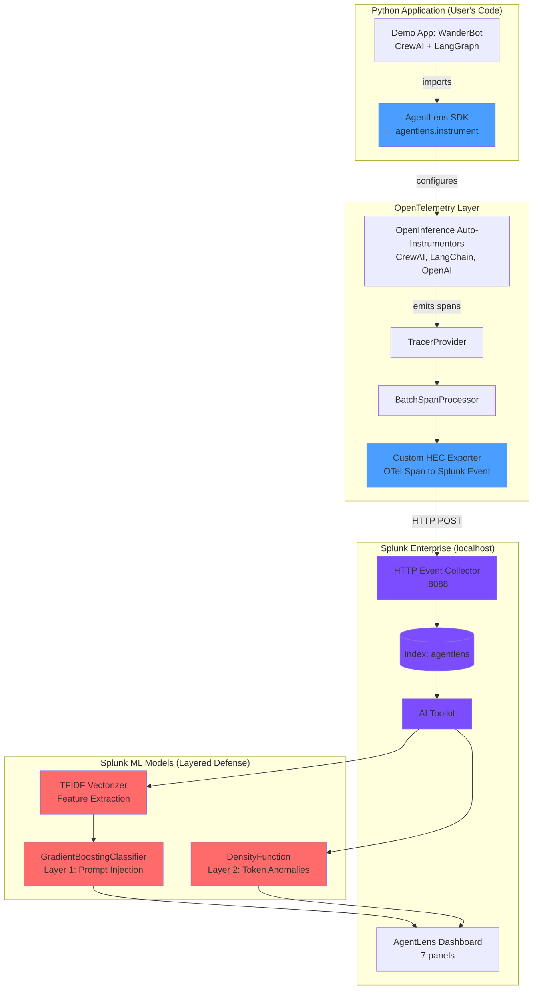

# AgentLens Architecture

Render the diagram below at [mermaid.live](https://mermaid.live) or with the VS Code Mermaid extension, then save the PNG as `docs/architecture.png`.

## Data Flow

`agentlens.instrument()` registers three OpenInference instrumentors (CrewAI, LangChain, OpenAI) against a single `TracerProvider` backed by a `BatchSpanProcessor`. Every agent call, LLM invocation, and tool execution emits an OTel span; the exporter converts each span to a Splunk HEC JSON event and POSTs them in newline-delimited batches to port 8088. Events land in `index=agentlens` with sourcetype `agentlens:event`. Splunk AI Toolkit runs two ML detection layers against the index: Layer 1 is a TF-IDF vectorizer feeding a GradientBoostingClassifier trained on 550 labeled prompts (including embedded-injection patterns) that catches direct prompt injection attacks; Layer 2 is a DensityFunction trained on LLM token-usage distributions that catches anomalies like cost-runaway attacks the classifier misses. Results surface in a 7-panel Dashboard Studio view with single-value scorecards, timecharts, and a flagged-events table.
